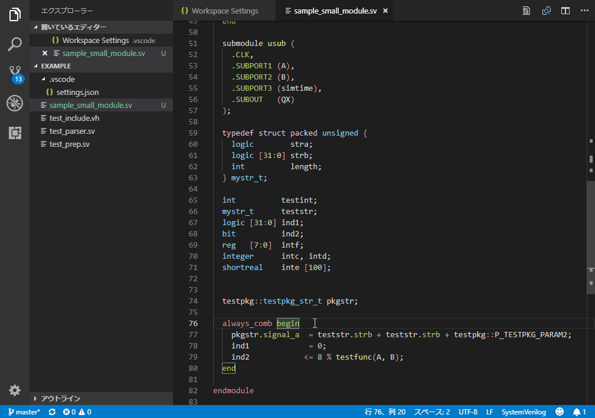
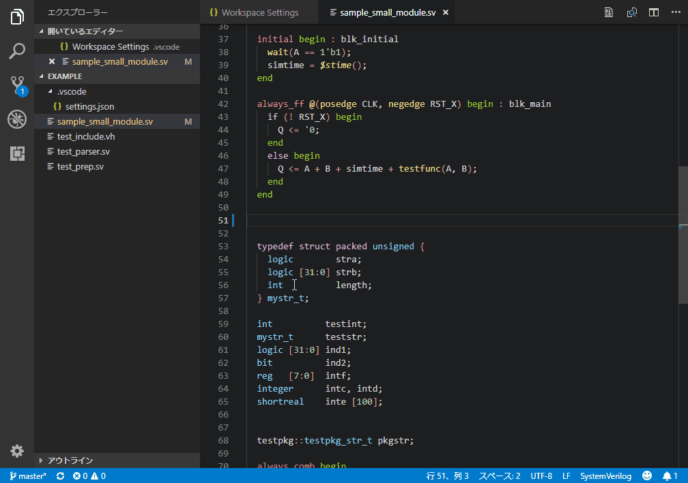
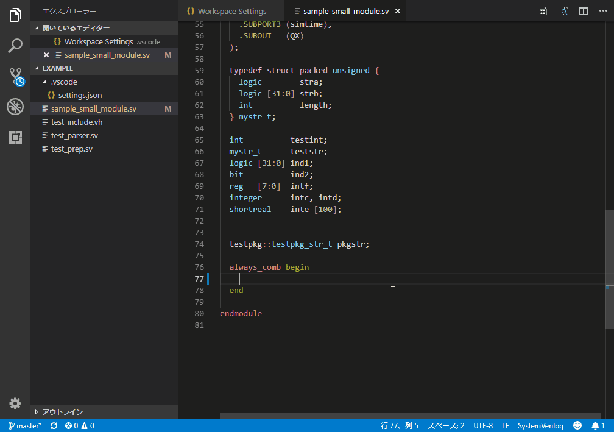
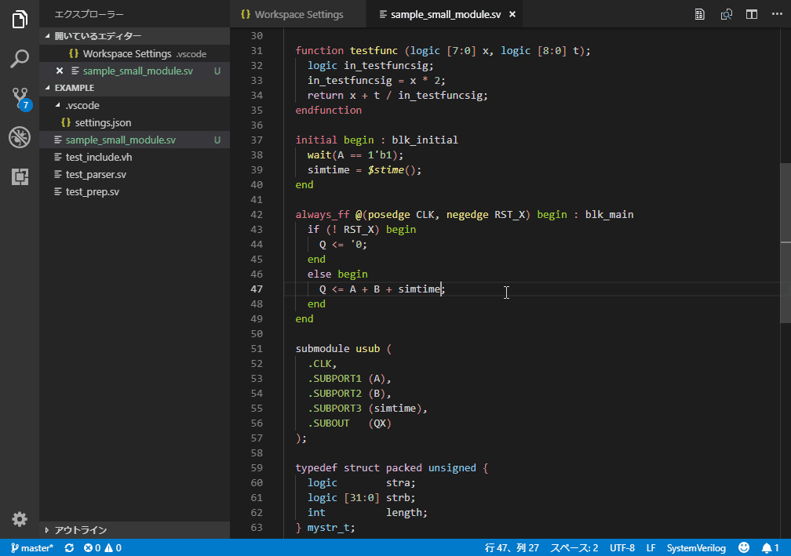
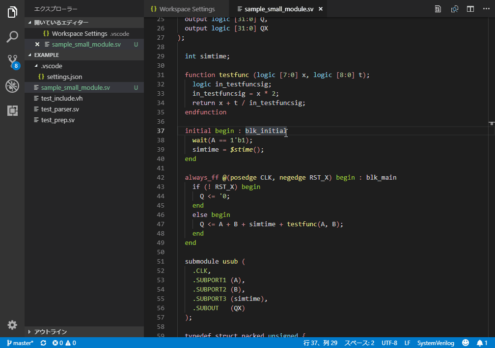
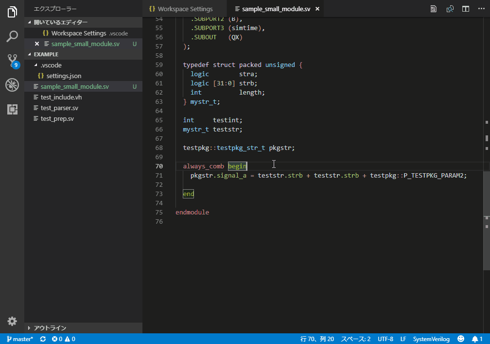
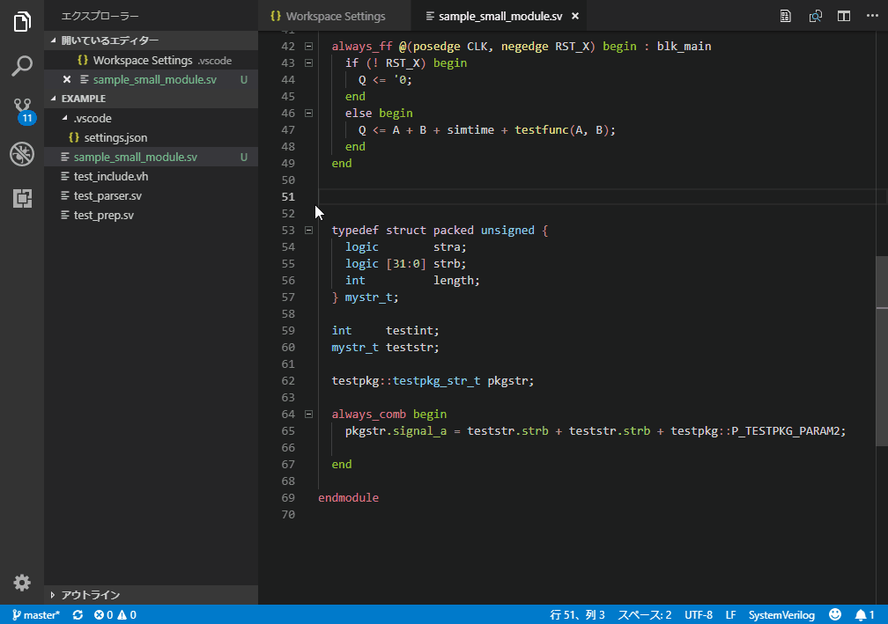
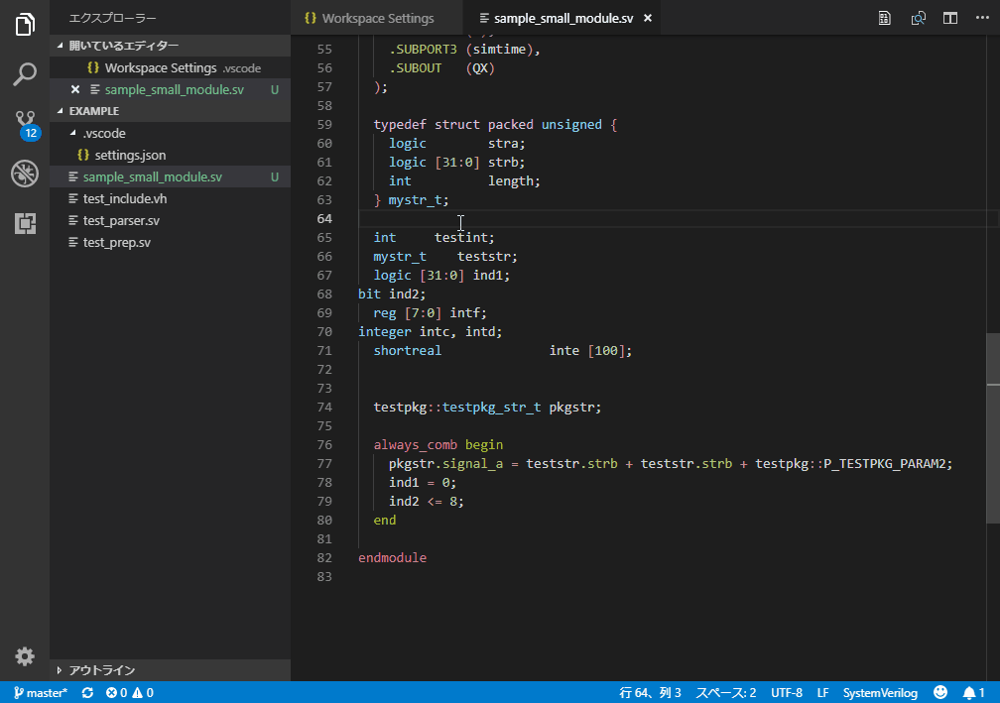

<!-- TOC -->

- [SystemVerilog extension for VSCode](#systemverilog-extension-for-vscode)
- [Applying SystemVerilog color theme](#applying-systemverilog-color-theme)
- [Parsing](#parsing)
  - [Diagnosis](#diagnosis)
  - [Collecting information](#collecting-information)
  - [Preprocessing](#preprocessing)
  - [Grammar limitation](#grammar-limitation)
- [Hover](#hover)
- [Completion](#completion)
  - [Module completion](#module-completion)
  - [Variable completion](#variable-completion)
- [Signature help](#signature-help)
- [Document symbol](#document-symbol)
- [Definition](#definition)
- [References](#references)
- [Commands](#commands)
  - [Instatiating module command](#instatiating-module-command)
  - [Auto indentation command (beta)](#auto-indentation-command-beta)
- [Options](#options)
- [Setup for developping (from git repository)](#setup-for-developping-from-git-repository)
  - [ANTLR4](#antlr4)
  - [Initialize](#initialize)
  - [Create your own commands](#create-your-own-commands)

<!-- /TOC -->

# SystemVerilog extension for VSCode

The extension offers:
* Syntax coloring
* Color theme for SystemVerilog
* A SystemVerilog(SV) parser
  * supporting limitted grammar, mainly for designing, not verifying.
  * collecting information of ports, variables, tasks, functions, modules, packages, and classes
  * generating syntactical diagnosis (not contextual)
  * supports preprocessing for the limited use
* IntelliSense with language server, which responds to
  * hover
  * completion
  * signatureHelp
  * documentSymbol
  * definition
  * references
* SV specific commands
* Auto indentation with aligning


# Applying SystemVerilog color theme
SystemVerilog theme is based on Dark+. 
The theme does not prevent other language coloring.

```
[Ctrl+K], [Ctrl+T]
select SystemVerilog
```


# Parsing
## Diagnosis


## Collecting information
The extension collects the following information.

* Module/package/class declaration
* Typedefs
* Parameter decls.
* Ports decls.
* Variable decls.
* Functions/tasks
* Block identification

## Preprocessing
The directives of define/undef/ifdef/else/endif/include/timescale are supported.

However, hints and completion of text macros are not supported.
Nested preprocessing is currently limited

## Grammar limitation
The following grammar set are not supported.

* Attributes
* OVM
* Advanced assertion usage


# Hover


Mouse hover displays collected information on it.


# Completion
## Module completion


Completion hints for module ports are triggered by "." in port connection description.

## Variable completion


Completion hints for variables are triggered automatically.
To explicitly invocate, press [Ctrl+Space] for any time, 
press "." after structured variable, 
press "::" after scopes such as package.

Also, nested struct/pkg/class declarations can be resolved.


# Signature help


Signature help triggered by typing "(" after module instantiation and function/task call.


# Document symbol


Press [Ctrl+Shift+O], then the document symbols are displayed, 
type ambiguously to narrow candidates, select symbols to jump.

Also, outlines are available in the left pain.


# Definition


Press [Ctrl+Left click] to jump to the definition. [F12] also jumps. 

Press [Alt+F12] to show in inline editor.


# References


Press [Shift+F12] to call all references of the variable.


# Commands

All commands are called with [Ctrl+Shift+P] "sv:----".

| Command                       | Description                                                        |
|:------------------------------|:-------------------------------------------------------------------|
| Align regexp                  | align selected lines as the first match of input regexp be aligned |
| Align comment                 | same as Align regexp "//"                                          |
| Align parenthesis             | same as Align regexp "("                                           |
| Instantiate module            | complete module instantiation description                          |
| Auto indent for SystemVerilog | automatically indent and align the selected line around            |

(Other commands are specific to my personal use)


## Instatiating module command


Call "sv:Instantiate module" on module entity, 
then all port connection templates are expanded in declaration order.


## Auto indentation command (beta)


Indent and align automatically.

Clumsy feature for ordinary users 
because this functionality is not based on parser.


# Options
| Option                 | Description                                                               |
|:-----------------------|:--------------------------------------------------------------------------|
| svlog.enLogging        | language server logging to your console.                                  |
| svlog.initialFileLists | paths of the files that contains verilog file paths to initially analyzed |
| svlog.includePath      | include search paths (relative to the root of your workspace)             |

# Setup for developping (from git repository)
## ANTLR4
You need to install ANTLR4 (http://www.antlr.org/).

Add ANTLR4 to your environment PATH, letting the following command be executable.

```
java org.antlr.v4.Tool %*
```


## Initialize
After you clone the repositiory, you should run vscode tasks.

```
[Ctrl+T]
npm: init-setup
```

npm install and post install will run.
Now you can use the extension.

Furthermore, if you want to develop or customize, run:

```
[Ctrl+T]
gen_parser
```

Parser *.ts are generated from grammer files.

## Create your own commands
